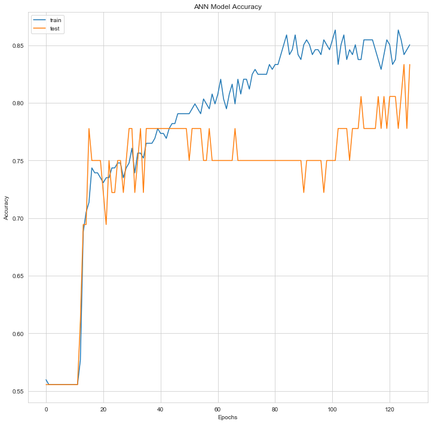

# Predicting Heart Disease Class (Absence or Presence) with XGBoost and Artificial Neural Networks 

## Problem Statement

The purpose of this study is based on the available data, it was estimated whether **absence** or **presence** of **heart disease**.

## Dataset

Dataset is downloaded from [archive.ics.uci.edu](https://archive.ics.uci.edu/ml/datasets/Statlog+%28Heart%29) website. You can find the details of the dataset in that website and also in the ***heart.doc*** named file. Dataset has **14 columns** and **270 rows without the header**.

 
-- **1.** age  
-- **2.** sex  
-- **3.** chest pain type  (4 values)  
-- **4.** resting blood pressure  
-- **5.** serum cholestoral in mg/dl  
-- **6.** fasting blood sugar > 120 mg/dl  
-- **7.** resting electrocardiographic results  (values 0,1,2)  
-- **8.** maximum heart rate achieved  
-- **9.** exercise induced angina  
-- **10.** oldpeak = ST depression induced by exercise relative to rest  
-- **11.** the slope of the peak exercise ST segment  
-- **12.** number of major vessels (0-3) colored by flourosopy  
-- **13.**  thal: 3 = normal; 6 = fixed defect; 7 = reversable defect

## Methodology

In this project, as stated in the title, results were obtained through **XGBoost** and **artificial neural networks** methods. 

## Analysis

| # | Column | Non-Null Count | Dtype |
|--|--|--|--|
| 0 | 0 | 270 non-null | float64
| 1 | 1 | 270 non-null | float64
| 2 | 2 | 270 non-null | float64
| 3 | 3 | 270 non-null | float64
| 4 | 4 | 270 non-null | float64
| 5 | 5 | 270 non-null | float64
| 6 | 6 | 270 non-null | float64
| 7 | 7 | 270 non-null | float64
| 8 | 8 | 270 non-null | float64
| 9 | 9 | 270 non-null | float64
| 10 | 10 | 270 non-null | float64
| 11 | 11 | 270 non-null | float64
| 12 | 12 | 270 non-null | float64
| 12 | 12 | 270 non-null | int64

dtypes: **float64(13), int64(1)**

***Confusion Matrix(XGBoost):***
| 38 | 6 |
|--|--|
| **15** | **31** |

> **Accuracy score(XGBoost): 0.7666666666666667**

| Layer (type) | Output Shape | Param # |
|--|--|--|
| dense_4 (Dense) | (None, 16) | 84 |
| dense_5 (Dense) | (None, 32) | 42 |
| dense_6 (Dense) | (None, 16) | 7 |

**Total params:** 133
**Trainable params:** 133
**Non-trainable params:** 0

> **Process took 1.2764582633972168 seconds.**

You can find plot of test and train accuracy in ***Plot*** folder. Accuracy values and also plot can change a bit after if you run the algorithm with another model. **model.h5** represents **model_val_accuracy.png** graph. If you would like to see visualized ANNs model, please take a look at **ann.pdf** file 

## How to Run Code

Before running the code make sure that you have these libraries:

 - pandas 
 - time
 - sklearn
 - seaborn
 - numpy
 - warnings
 - xgboost
 - matplotlib
 - keras
 - ann_visualizer
    
## Contact Me

If you have something to say to me please contact me: 

 - Twitter: [Doguilmak](https://twitter.com/Doguilmak)  
 - Mail address: doguilmak@gmail.com
 
